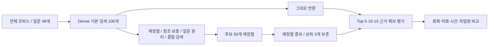

# 건설 기준 검색 Pilot — 논문 작성용 자료

2026-09-28에 완료한 `evidence_response_pilot_v4`의 질문, 정답 근거 ID, 실행 기록, 결과와 코드를 모았다. **논문 작성·검토용 공개 자료이며, 전문가가 검증한 공개 벤치마크가 아니다.** 기준 원문 전문은 포함하지 않는다.

## 먼저 읽을 문서

1. [CLAUDE.md](CLAUDE.md): 이번 논문의 범위와 작성 시 지킬 사항
2. [연구 배경과 논문 구성](docs/PAPER_BRIEF.md)
3. [데이터셋과 전처리](docs/DATASET.md)
4. [실제 실험 조건](docs/EXPERIMENT_CONDITIONS.md): 이전 설정과 다른 부분까지 정리
5. [결과](experiments/evidence_response_pilot_v4/RESULTS.md) → [해석과 한계](experiments/evidence_response_pilot_v4/DISCUSSION.md)
6. [파일 안내·검증 방법](docs/REPRODUCIBILITY.md)

## 무엇을 비교했나

전체 검색 코퍼스 **3,520문서·557,027절**을 대상으로, 네 유형 각 12개씩 총 48문항을 평가했다. 철도에 별도 할당량을 두거나 철도를 제외하지 않았다. 같은 질문에 각 고정 작업을 따로 적용하고 **필수 근거를 모두 확보했는지**, **기존 성공이 악화됐는지**, **얼마나 시간이 추가됐는지** 비교했다. 답변 생성, Agent 실행, 선택 모델 학습은 하지 않았다.



## 핵심 결과

표의 성공은 ‘답변 정확도’가 아니라 **필수 근거 전체 확보(Complete Evidence Success)**다. 각 분모는 48이다.

| 방법 | Top 5 | Top 10 | Top 15 | 평균 시간 ms |
|---|---:|---:|---:|---:|
| Dense 그대로 (STOP) | 34 | 42 | 43 | 14.38 |
| 재정렬 (RERANK) | 43 | 47 | 47 | 177.23 |
| 참조 보충+재정렬 (REFERENCE) | 43 | 47 | 48 | 177.62 |
| 질문 분리+재정렬 (SPLIT) | 42 | 46 | 47 | 189.01 |
| 결합 검색+재정렬 (HYBRID_RERANK) | 43 | 46 | 47 | 246.52 |
| 재정렬+기본 상위 3개 보존 (KEEP3) | 43 | 46 | 47 | 177.24 |

시간은 질문별 2회 반복을 평균한 뒤 48문항을 평균한 **구간 합산 시간**이다. 실제 요청 전체의 end-to-end latency가 아니며, 두 날짜의 측정이 섞여 있다. 외부 API 호출 0회가 연산 비용 0원을 뜻하지 않는다.

이번 표본에서는 기본 검색 Top 10에 부족했던 6문항의 근거가 모두 Top 100 안에 있었다. 재정렬이 5문항을 회복했다. 참조 보충의 추가 회복은 Top 15에서 1문항이었다. 초기 후보 자체가 없는 문제나 학습 선택의 효과는 검증하지 못했다.

## 바로 확인하기

- [질문 48개와 Gold ID](experiments/evidence_response_pilot_v4/questions.jsonl)
- [질문별·방법별·Top-k 결과 CSV](experiments/evidence_response_pilot_v4/run_20260928/question_action_metrics.csv)
- [실행 manifest](experiments/evidence_response_pilot_v4/run_20260928/manifest.json)
- [실제 적용 설정 요약](provenance/effective_settings.json)
- [읽기 쉬운 질문·답변 초안·근거 목록](docs/QUESTION_INDEX.md)
- [기존 문헌 검토 기록](background/LITERATURE_REVIEW_20260923.md): 최종 인용 전 원문·서지 재확인

## GPU 없이 결과 다시 확인

Python 3.10 이상, 추가 패키지·네트워크·모델·전체 DB 없이 실행한다.

```bash
python3 tools/verify_handoff.py
python3 -m unittest discover -s tests -v
python3 -m unittest discover -s experiments/evidence_response_pilot_v4 -p 'test_*.py' -v
```

전체 코퍼스, Dense 임베딩, 모델 가중치는 포함하지 않았다. 따라서 **저장된 결과의 재채점은 가능하지만, 새 검색 추론은 이 저장소만으로 실행되지 않는다.** 자세한 준비물과 검증 범위는 [재현 안내](docs/REPRODUCIBILITY.md)를 따른다.

## 접근과 권리

사용자 요청에 따라 공개한다. Claude에는 이 저장소 링크와 `CLAUDE.md`를 먼저 읽으라는 요청을 전달한다. 사용 중인 Claude 환경에서 링크 읽기를 지원하지 않으면 저장소를 내려받아 문서를 첨부하거나 Claude Code에서 clone한다. 공개 링크라는 사실이 모든 Claude 환경의 자동 접근을 보장하지는 않는다.

기준 원문 전문·대량 발췌는 재배포 범위를 확인하지 못해 제외했다. 공개용 QA는 원문 본문을 제거한 파생본이므로 원 실험 QA와 파일 해시가 다르다. 질문·Gold ID·순위·채점 결과는 바꾸지 않았다. [데이터 범위와 권리](docs/DATA_AVAILABILITY.md)를 확인한다.
